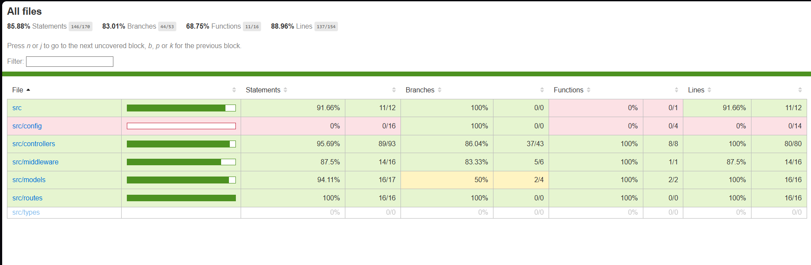

# Task Tracker API

A RESTful Task Tracker backend built with Node.js, TypeScript, Express, MongoDB, and Redis.

**Frontend Repository:** [zen-taskly-front](https://github.com/aryuun1/zen-taskly-front)

---

## Tech Stack

- **Runtime:** Node.js + TypeScript
- **Framework:** Express
- **Database:** MongoDB (via Mongoose)
- **Cache:** Redis
- **Auth:** JWT + bcryptjs
- **Testing:** Jest + Supertest + mongodb-memory-server

---

## Prerequisite

Make sure you have the following installed/running:

- Node.js >= 18
- MongoDB (running on port `27017`)
- Redis (running on port `6379`)

> If using Docker, see the [Docker Setup](#docker-setup) section below.

---

## Getting Started

### 1. Clone the repository

```bash
git clone <your-repo-url>
cd task-back
```

### 2. Install dependencies

```bash
npm install
```

### 3. Set up environment variables

```bash
cp .env.example .env
```

Open `.env` and fill in your values (see [Environment Variables](#environment-variables) below).

### 4. Start the development server

```bash
npm run dev
```

You should see:

```text
MongoDB connected
Redis connected
Server running on port 3000
```

---

## Environment Variables

| Variable         | Description                        | Example                                 |
|------------------|------------------------------------|-----------------------------------------|
| `PORT`           | Port the server listens on         | `3000`                                  |
| `MONGO_URI`      | MongoDB connection string          | `mongodb://localhost:27017/tasktracker` |
| `REDIS_URL`      | Redis connection URL               | `redis://localhost:6379`                |
| `JWT_SECRET`     | Secret key for signing JWT tokens  | `change_this_to_a_long_random_string`   |
| `JWT_EXPIRES_IN` | JWT token expiry duration          | `7d`                                    |

See `.env.example` for a template.

---

## Scripts

| Command                  | Description                          |
|--------------------------|--------------------------------------|
| `npm run dev`            | Start dev server with hot reload     |
| `npm run build`          | Compile TypeScript to `dist/`        |
| `npm start`              | Run compiled production build        |
| `npm test`               | Run all tests                        |
| `npm run test:coverage`  | Run tests with coverage report       |

---

## API Reference

### Auth

| Method | Endpoint            | Description         | Auth Required |
|--------|---------------------|---------------------|---------------|
| POST   | `/api/auth/signup`  | Register a new user | No            |
| POST   | `/api/auth/login`   | Login, returns JWT  | No            |

#### POST `/api/auth/signup`

**Request body:**

```json
{
  "name": "John Doe",
  "email": "john@example.com",
  "password": "secret123"
}
```

**Response `201`:**

```json
{
  "token": "<jwt>",
  "user": { "id": "...", "name": "John Doe", "email": "john@example.com" }
}
```

---

#### POST `/api/auth/login`

**Request body:**

```json
{
  "email": "john@example.com",
  "password": "secret123"
}
```

**Response `200`:**

```json
{
  "token": "<jwt>",
  "user": { "id": "...", "name": "John Doe", "email": "john@example.com" }
}
```

---

### Tasks

All task endpoints require the `Authorization: Bearer <token>` header.

| Method | Endpoint           | Description                      |
|--------|--------------------|----------------------------------|
| GET    | `/api/tasks`       | Get all tasks for logged-in user |
| POST   | `/api/tasks`       | Create a new task                |
| PUT    | `/api/tasks/:id`   | Update a task by ID              |
| DELETE | `/api/tasks/:id`   | Delete a task by ID              |

#### Query Parameters for `GET /api/tasks`

| Param     | Type   | Description                        |
|-----------|--------|------------------------------------|
| `status`  | string | Filter by `pending` or `completed` |
| `dueDate` | string | Filter by due date (`YYYY-MM-DD`)  |

**Example:** `GET /api/tasks?status=pending`


---

#### POST `/api/tasks`

**Request body:**

```json
{
  "title": "Finish assignment",
  "description": "Complete the task tracker API",
  "status": "pending",
  "dueDate": "2026-03-10"
}
```

**Response `201`:**

```json
{
  "_id": "...",
  "title": "Finish assignment",
  "description": "Complete the task tracker API",
  "status": "pending",
  "dueDate": "2026-03-10T00:00:00.000Z",
  "owner": "...",
  "createdAt": "..."
}
```

---

## Redis Caching Strategy

- `GET /api/tasks` results are cached per user with key `tasks:<userId>`
- Cache TTL: **60 seconds**
- Cache is **invalidated** on every `POST`, `PUT`, or `DELETE` task operation
- This ensures users always get fresh data after any mutation


---

## Database Design


---

## Project Structure

```text
src/
├── config/         # DB and Redis connection setup
├── controllers/    # Route handler logic
├── middleware/     # JWT auth middleware
├── models/         # Mongoose schemas
├── routes/         # Express route definitions
├── types/          # TypeScript type extensions
├── app.ts          # Express app setup
└── server.ts       # Server entry point
tests/              # Jest unit + integration tests
```

---

## Docker Setup

The project ships with a multi-stage `Dockerfile` and a `docker-compose.yml` that orchestrates all three services — the API, MongoDB, and Redis — in one command.

### Services

| Service | Image | Port(s) |
| ------- | ----- | ------- |
| `api` | Built from `Dockerfile` (Node 18 Alpine, 2-stage) | `3000` |
| `mongo` | `mongo:7` | `27017` |
| `redis` | `redis/redis-stack:latest` | `6379`, `8001` (RedisInsight UI) |

### Prerequisites

- [Docker](https://docs.docker.com/get-docker/) installed and running
- [Docker Compose](https://docs.docker.com/compose/install/) v2+ (bundled with Docker Desktop)

### 1. Clone and enter the project

```bash
git clone <your-repo-url>
cd task-back
```

### 2. Build and start all services

```bash
docker compose up --build
```

> Use `-d` to run in detached (background) mode:
>
> ```bash
> docker compose up --build -d
> ```

This will:

1. Build the API image using the multi-stage `Dockerfile` (compiles TypeScript → production Node image)
2. Pull `mongo:7` and `redis/redis-stack:latest` if not already cached
3. Start all three containers — `task-api`, `task-mongo`, `task-redis`
4. Wait for MongoDB and Redis health checks to pass before starting the API

You should see:

```text
MongoDB connected
Redis connected
Server running on port 3000
```

### 3. Verify running containers

```bash
docker compose ps
```

```text
NAME          IMAGE                      STATUS          PORTS
task-api      task-back-api              Up              0.0.0.0:3000->3000/tcp
task-mongo    mongo:7                    Up (healthy)    0.0.0.0:27017->27017/tcp
task-redis    redis/redis-stack:latest   Up (healthy)    0.0.0.0:6379->6379/tcp, 0.0.0.0:8001->8001/tcp
```

### 4. Access the services

| Service | URL |
| ------- | --- |
| API | `http://localhost:3000` |
| MongoDB | `mongodb://localhost:27017/tasktracker2` |
| Redis | `redis://localhost:6379` |
| RedisInsight UI | `http://localhost:8001` |


### Useful commands

```bash
# View logs for all services
docker compose logs -f

# View logs for a specific service
docker compose logs -f api
docker compose logs -f mongo
docker compose logs -f redis

# Stop all services (keeps volumes/data)
docker compose down

# Stop and remove volumes (wipes all data)
docker compose down -v

# Rebuild only the API image (after code changes)
docker compose up --build api
```

### Notes

- MongoDB and Redis data are persisted in named Docker volumes (`mongo_data`, `redis_data`) so data survives container restarts.
- The API container will not start until both MongoDB and Redis pass their health checks.
- Environment variables are defined inline in `docker-compose.yml`. For production, replace `JWT_SECRET` with a strong random secret.


---

## Running Tests

```bash
# Run all tests
npm test

# With coverage report
npm run test:coverage
```

Tests use `mongodb-memory-server` (in-memory MongoDB) and mock Redis — no real DB connections needed.

---


